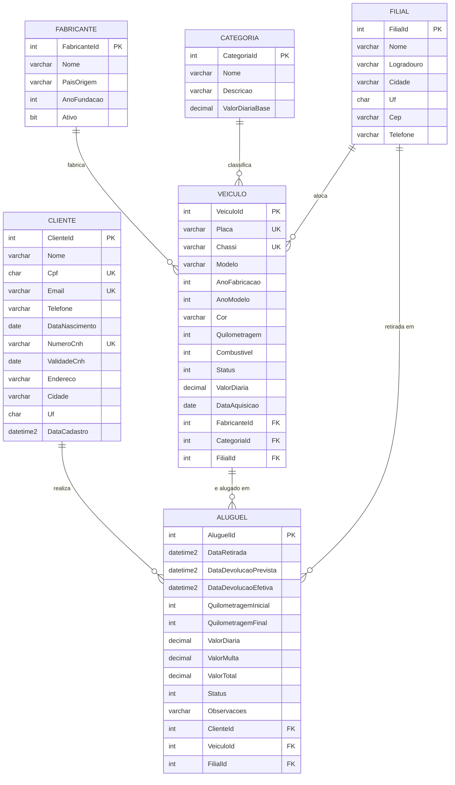

# Modelo conceitual - Locadora de Veículos

## Entidades e justificativa

| Entidade | Por que existe |
|---|---|
| **Fabricante** | Regra 1.1 diz que todo veículo pertence a um fabricante. Separar a marca em tabela própria evita repetir o nome em cada veículo e permite consultar a frota por marca. |
| **Categoria** | Entidade extra (item 1.5). Agrupa os veículos por grupo tarifário (Hatch, Sedan, SUV, Utilitário) e guarda o valor de diária base usado como referência na hora de montar o preço do veículo. |
| **Filial** | Entidade extra. A locadora tem mais de uma unidade; o veículo fica alocado em uma filial e o aluguel é retirado em uma delas. |
| **Veículo** | Item da frota. Guarda modelo, ano de fabricação e quilometragem, conforme exigido. |
| **Cliente** | Quem aluga. Nome, CPF e e-mail são obrigatórios; CNH foi incluída porque sem ela não há locação. |
| **Aluguel** | Entidade associativa entre Cliente e Veículo dentro de um período. Guarda o registro da devolução, km inicial/final, valor da diária e valor total. |

## Relacionamentos

- Fabricante (1) → (N) Veículo
- Categoria (1) → (N) Veículo
- Filial (1) → (N) Veículo
- Cliente (1) → (N) Aluguel
- Veículo (1) → (N) Aluguel
- Filial (1) → (N) Aluguel (filial de retirada)

O relacionamento N:N entre Cliente e Veículo foi resolvido pela tabela **Alugueis**, que além das duas chaves estrangeiras carrega os atributos próprios da locação (período, quilometragem e valores).

## Diagrama ER

## Restrições de integridade

**Chaves primárias:** todas as tabelas usam chave substituta inteira com `IDENTITY(1,1)`.

**Chaves estrangeiras:** todas com `ON DELETE NO ACTION`. A escolha foi proposital: apagar um cliente ou um veículo não pode arrastar o histórico de locações junto, e o SQL Server também não aceitaria múltiplos caminhos de cascata chegando em `Alugueis` pela `Filial`.

**Chaves únicas:**
- `Fabricantes.Nome`, `Categorias.Nome`
- `Veiculos.Placa`, `Veiculos.Chassi`
- `Clientes.Cpf`, `Clientes.Email`, `Clientes.NumeroCnh`

**Check constraints:**
- `CK_Veiculo_AnoFabricacao`: ano entre 1900 e 2100
- `CK_Veiculo_Quilometragem`: km não pode ser negativa
- `CK_Veiculo_ValorDiaria` e `CK_Categoria_ValorDiariaBase`: valor maior que zero
- `CK_Cliente_Cpf`: CPF com exatamente 11 dígitos
- `CK_Aluguel_Periodo`: devolução prevista posterior à retirada
- `CK_Aluguel_Quilometragem`: km final nula (locação em aberto) ou maior/igual à inicial
- `CK_Aluguel_ValorDiaria`: valor maior que zero

**Nulidade:** `DataDevolucaoEfetiva`, `QuilometragemFinal` e `ValorTotal` aceitam nulo porque só são preenchidos no momento da devolução. Enquanto o aluguel está em andamento, esses campos ficam vazios e o `Status` fica como `EmAndamento`.
